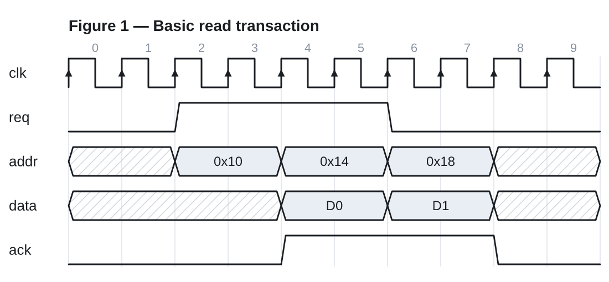
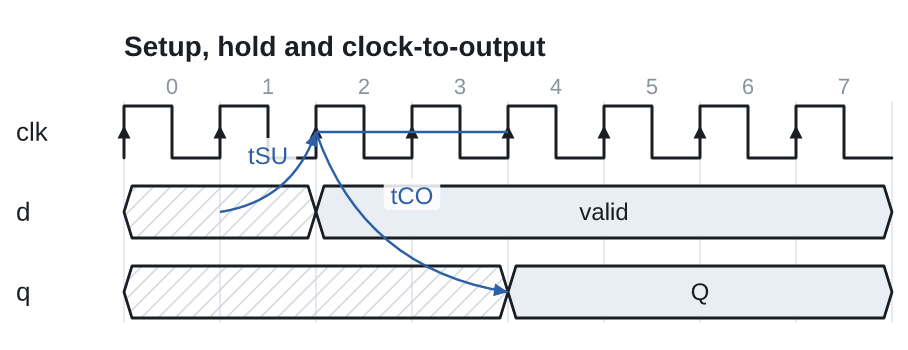
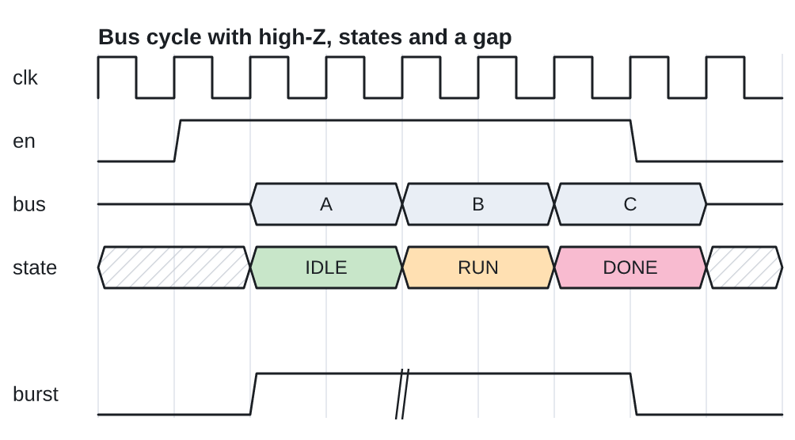
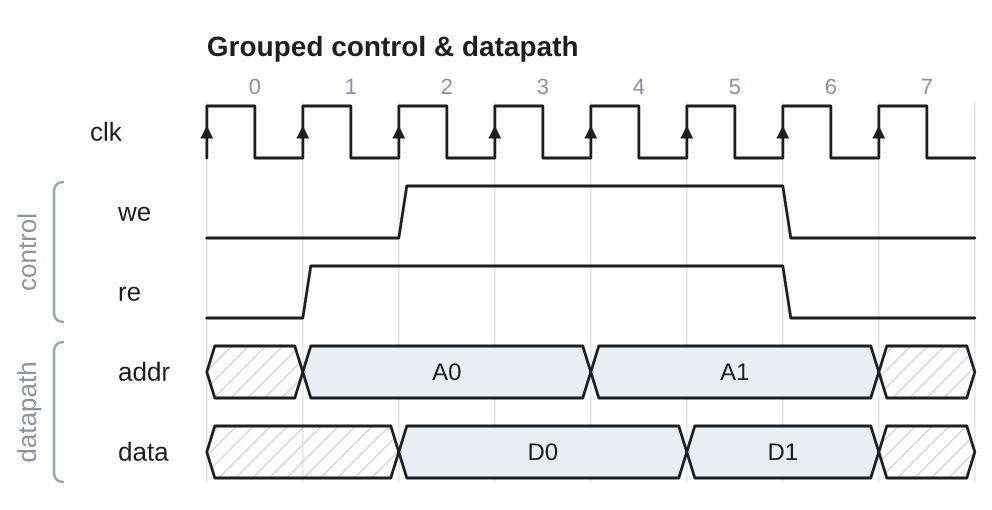
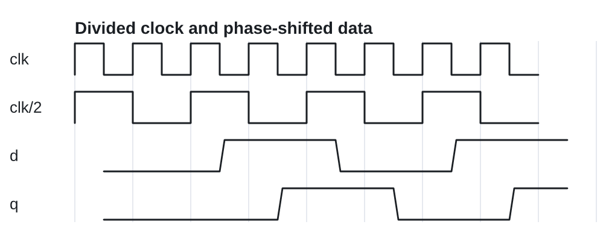

# WavePicGen · 数字时序图编辑器

> 一个**严肃 / 学术 / 手册级（manual-quality）**的数字电路时序图（timing / waveform diagram）绘制工具。
> 产出可直接放进**教科书、芯片数据手册、规格书、学术论文**的矢量图。

WavePicGen 把 [WaveDrom](https://wavedrom.com/) 式的「**文本可编辑 · 可命令行 · 矢量输出**」与
[TimeGen](https://www.xfusionsoftware.com/) 式的「**所见即所得编辑 · 关系标注**」结合在一个统一的文档模型之上，
开源、跨平台、出图确定可复现。





| 总线 / 高阻 / 状态 / 间隔 | 分组 | 分频与相位（亚周期） |
| --- | --- | --- |
|  |  |  |

---

## ✨ 特性

- **图形界面 + 命令输入**：左侧编辑可编辑的波形源（WaveJSON / JSON5），右侧实时渲染；底部命令栏支持 `add clock CLK`、`set hscale=2`、`export png` 等命令——三者驱动**同一个文档模型**。
- **专业编辑器（CodeMirror）**：语法高亮、行号、撤销/重做、`Tab` 缩进、**行内解析错误提示**（红色波浪线定位到行/列）。
- **画布直接编辑**：在预览中**点击信号单元循环 0/1/x/z**，或**横向拖拽改沿**（把电平刷过若干周期＝移动跳变 / 加延迟）；改动回写文档模型与源码，GUI ↔ 模型 ↔ 文本三向同步。
- **可编辑波形格式**：纯文本、可手写、可脚本生成、Git diff 友好；完全 **WaveJSON 兼容**（已有 WaveDrom 图可直接粘贴使用）。
- **矢量优先**：内部以 **SVG** 为渲染产物；导出 **SVG（矢量）/ PNG / JPEG**（PNG/JPEG 可设 1×–4× 缩放）、以及 **PDF**（经浏览器打印为矢量 PDF，字体与 CJK 完美还原）。
- **边沿与关系标注**：`node` 命名锚点 + `edge` 箭头（直线/样条/折线、单双向箭头、文字标签），用于 setup/hold/传播延迟等时序关系——把波形升级为「时序规格」。
- **手册级排版**：白底深线、字体可控、网格对齐、时钟箭头、总线六边形、高阻中线、未知态斜纹、间隔标记、信号分组、周期刻度、表头/表尾。
- **分频与相位**：`period` 分频、`phase` 相位偏移（含小数 → 亚周期/异步的雏形，补 WaveDrom「跳变只能落周期边界」的短板）。
- **跨平台 · 易部署**：纯前端静态应用（Vite + TypeScript），在任意浏览器运行；`dist/` 可丢到任意静态托管，Windows / Linux 一致。
- **可复现 · 可测**：渲染引擎与 GUI 解耦的纯函数核心；**58 个单元/组件测试**；同一输入逐像素一致。

## 🚀 快速开始

需要 Node.js ≥ 20。

```bash
npm install        # 安装依赖
npm run dev        # 本地开发（热更新）→ 打开终端提示的 http://localhost:5173
npm run build      # 生产构建 → 输出到 dist/
npm run preview    # 预览构建产物 → http://localhost:4173
npm test           # 运行测试
npm run check      # typecheck + test + build 一条龙
```

部署：执行 `npm run build`，把 `dist/` 目录部署到任意静态服务器（Nginx / GitHub Pages / 对象存储均可）。
仓库已内置 GitHub Pages 部署工作流（见 `.github/workflows/deploy-pages.yml`）。

## 📝 使用

**源格式**（WaveJSON / JSON5，支持注释、无引号键、尾逗号）：

```jsonc
{
  signal: [
    { name: 'clk',  wave: 'P.P.P.P.' },
    { name: 'req',  wave: '0.1...0.' },
    { name: 'addr', wave: 'x.=.=.x.', data: ['0x10', '0x14'] },
    ['datapath',
      { name: 'data', wave: 'x...=.x.', data: ['D0'] },
    ],
  ],
  head: { text: 'Figure 1 — Read transaction', tick: 0 },
  config: { hscale: 1 },
}
```

**波形字符**：`p P n N`（时钟，大写带箭头）· `0 1`（电平）· `= 2…9`（数据/总线，配 `data[]`，数字选配色）·
`x`（未知，斜纹）· `z`（高阻，中线）· `u d`（弱上/下拉）· `.`（延续）· `|`（间隔）。

**命令栏**（输入 `help` 查看全部）：
`add clock CLK cycles=6` · `add signal EN wave=01.0` · `add bus DATA cycles=3` ·
`set hscale=2` · `set head="My Figure"` · `example bus` · `export png scale=3` · `export svg` · `clear`。

**快捷键**：`Ctrl/⌘ + S` 导出 SVG；编辑器内 `Tab` 缩进；`Esc` 关闭帮助。

## 🖥️ 命令行 (CLI)

同一引擎也提供无头命令行，便于批量出图 / CI / 文档构建：

```bash
npm run cli -- fig.json5                 # SVG 输出到 stdout
npm run cli -- fig.json5 -o fig.png -s 3 # PNG（3× 缩放，经 resvg）
cat fig.json5 | npm run cli -- - -o fig.svg

# 或构建独立二进制后直接调用：
npm run build:cli
node dist/cli/wavepicgen.mjs fig.json5 -o fig.png
```

## 🧱 架构（高内聚 · 低耦合）

严格分层、依赖单向；**核心引擎是纯函数（无 DOM / 无 IO），可独立测试与复用**，GUI 只是它的薄外壳。

```
src/
├─ core/                 引擎（纯函数，无 DOM）—— 可被 GUI / CLI / 未来 Web 复用
│  ├─ theme.ts           渲染主题常量（颜色/尺寸/字体）
│  ├─ bricks.ts          wave 字符串 → 逐周期 brick 状态
│  ├─ model.ts           文档模型（WaveJSON 兼容）+ normalize
│  ├─ layout.ts          模型 → 几何场景图（Shape[]）★ 自研核心
│  ├─ svg.ts             几何 → SVG 字符串
│  ├─ render.ts          公共入口：source → { svg, width, height, warnings }
│  ├─ commands.ts        命令解释器（命令栏 / 未来 CLI 共用）
│  ├─ examples.ts        内置示例
│  └─ index.ts           对外 API 汇总
└─ ui/                   Web 外壳（DOM）
   ├─ app.ts             双栏编辑器 + 命令栏 + 预览 + 缩放 + 主题/帮助
   ├─ exporter.ts        SVG → PNG/JPEG/SVG 下载（canvas 光栅化）
   └─ styles.css         界面样式（主题变量；图本身始终白底，适合印刷）
```

数据流：`GUI / 文本 / 命令 → 文档模型（单一真相源）→ layout → SVG → 屏显 / 导出`。
这条「**引擎/外壳分离 + SVG 中间产物**」的设计来自仓库 `docs/` 的方案，保证 GUI 与导出**逐像素一致**。

复用既有轮子（不重复造）：栅格化/校验用 `resvg`（脚本/未来导出）、`json5`（解析）；编辑器外壳用 `vite` + `vitest`；
唯一自研的差异化核心是 `layout`（手册级排版几何）。详见 [`docs/04-architecture-proposal.md`](docs/04-architecture-proposal.md)。

## 🧪 测试

```bash
npm test            # 58 个测试：bricks / model / layout / svg / parse / render / commands / UI 冒烟
npm run test:cov    # 覆盖率（仅统计 core/）
npm run snapshot    # 把内置示例渲染为 SVG+PNG（用 resvg），便于肉眼/视觉回归检查
```

引擎为纯函数，测试不依赖浏览器；UI 冒烟测试用 happy-dom。`render()` 对同一输入产出**确定性**的 SVG，适合视觉回归。

## 📐 设计文档

完整的需求、调研、选型与架构方案在 [`docs/`](docs/)：

| 文档 | 内容 |
| --- | --- |
| [01 需求与范围](docs/01-requirements.md) | 需求拆解、目标、非目标、验收 |
| [02 同类工具调研](docs/02-landscape-survey.md) | WaveDrom / TimeGen / tikz-timing / undulate 等 |
| [03 技术栈评估](docs/03-tech-stack-evaluation.md) | 决策矩阵与选型理由 |
| [04 架构方案](docs/04-architecture-proposal.md) | 分层、依赖规则、Reuse Map、Build-vs-Reuse |
| [05 波形格式草案](docs/05-waveform-format-draft.md) | 文档模型 + DSL + 命令 |
| [06 路线图](docs/06-roadmap.md) | 里程碑、风险、待定决策 |

## 🗺️ 路线图（节选）

当前为**网页渲染**实现（文档中的「先 TS」阶段）。引擎已与 GUI 解耦，后续可平滑推进：

- [x] **边沿/关系标注**：`node` + `edge` 箭头与标签（setup/hold/delay）。✅
- [ ] **测量标尺**与带 `@时刻` 锚点的 typed relations。
- [x] 画布**点击直接编辑**：点击信号单元循环 0/1/x/z（回写模型与文本）。✅
- [x] 画布**拖拽改沿**：横向拖拽把电平刷过若干周期（移动跳变 / 加延迟）。✅
- [ ] 拖拽**总线/时钟**单元、插入/删除周期；保留注释的「最小文本补丁」式回写。
- [ ] **真实数边沿**：把 `phase` 的亚周期能力推广为任意时刻跳变。
- [ ] **PDF / EPS** 导出；**tikz-timing** 导出后端（服务 LaTeX 用户）。
- [ ] **Tauri** 桌面外壳打包（复用同一引擎）；命令行 `wavepicgen` 批量出图。

## 许可

[MIT](LICENSE)
